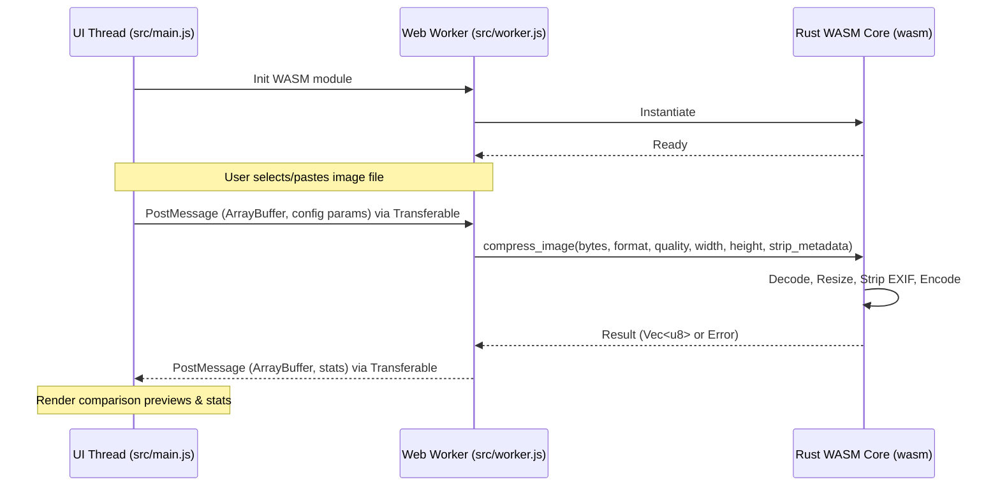

# Project Architecture

This document describes the high-level architecture of the Browser-Based Image Compressor.

## High-Level Architecture Diagram



## Core Components

### 1. UI Thread (`src/main.js`)
- Manages the visual state of the application.
- Listens for drop, file selection, and paste (`Ctrl+V`) events.
- Coordinates visual comparisons using a side-by-side comparison slider.
- Feeds configuration parameters (quality, target resolution, metadata settings) to the background worker.

### 2. Background worker (`src/worker.js`)
- Houses the WASM loading context off the main UI thread.
- Avoids page freezes during computationally heavy encoding routines.
- Uses `Transferable Objects` to pass raw binary buffers (array buffers) without overhead serialization/copying.

### 3. Rust WebAssembly Module (`wasm/`)
- Compiled via `wasm-pack` with target `--target web`.
- Leverages Rust's performance and safety to decode and compress image files.
- Uses the `image` crate for decoding (JPEG, PNG, WebP) and resizing, and `oxipng` or standard encoders for encoding.

## Message Contract (UI <-> Worker)

### Request Message from UI:
```json
{
  "type": "COMPRESS",
  "id": "file-unique-id",
  "arrayBuffer": ArrayBuffer, // Transferable
  "config": {
    "format": "jpeg" | "png" | "webp",
    "quality": 80, // 1 to 100
    "width": 1280, // or null
    "height": 720, // or null
    "stripMetadata": true
  }
}
```

### Response Message from Worker:
```json
{
  "type": "COMPRESS_SUCCESS",
  "id": "file-unique-id",
  "arrayBuffer": ArrayBuffer, // Transferable (compressed bytes)
  "stats": {
    "originalSize": 1245000,
    "compressedSize": 342000,
    "width": 1280,
    "height": 720,
    "format": "jpeg"
  }
}
```
Or error messages:
```json
{
  "type": "COMPRESS_ERROR",
  "id": "file-unique-id",
  "error": "Failed to decode image data"
}
```
